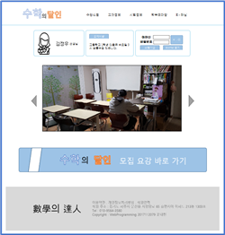
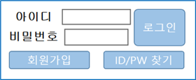
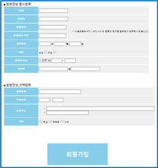
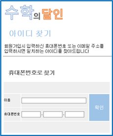
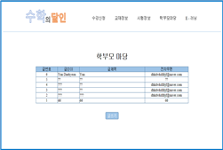
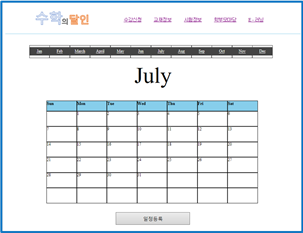

# Web_Project
공부방 사이트 개발하기

## Project Introduction
- 목적 : 다양한 정보와 소통의 장소를 마련하고, 공부방의 운영을 더 편리하고 원활하게 하기 위하여 공부방 사이트를 개발
- 사용 언어 : Java, JavaScript, HTML, CSS
- 주요 기능 : 로그인, 로그아웃, 회원가입, ID/PW 찾기, 게시판, 달력/일정표, 온라인 동영상 학습

## View Project
- 메인 화면

    
    
- 로그인, 로그아웃

    
    
- 회원가입

    

- ID/PW 찾기

    

- 게시판

    
    
- 달력/일정표

    
    
- 온라인 동영상 학습

    
